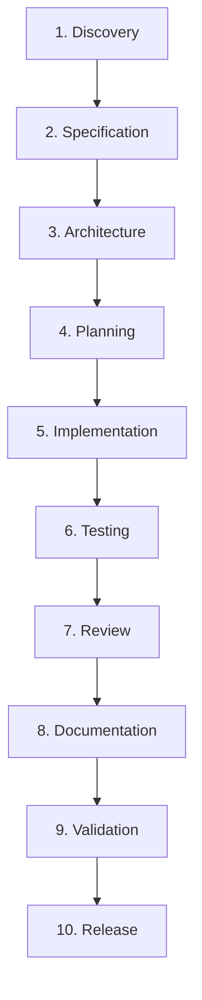

# Application Development Harness — Padrão de Engenharia Defendi

Repositório de especificação canônica, catálogo de perfis, templates reutilizáveis e ferramentas de governança para criação do **Application Development Harness** nos projetos do ecossistema **Defendi**.

---

## 📌 Visão Geral

Coding agents frequentemente operam com instruções dispersas, gerando perda de contexto entre sessões, alucinações de requisitos, falta de rastreabilidade com tarefas de negócio (Jira) e ausência de critérios determinísticos de qualidade.

O **Application Development Harness** resolve esses problemas instituindo uma camada de engenharia persistente, auditável e padronizada. Ele transforma o desenvolvimento assistido por IA em um processo estruturado, guiado por especificações e com quality gates executáveis, garantindo que o ciclo de software seja executado com rigor profissional de ponta a ponta.

Este repositório atua como a **fonte da verdade (Single Source of Truth)** para a criação, manutenção e evolução dos harnesses em todos os projetos da organização.

---

## 📂 Estrutura e Catálogo do Repositório

O repositório disponibiliza uma suíte completa de artefatos de referência prontos para uso:

```text
.
├── Padrão Engenharia Harness.md    # Especificação formal de engenharia (SPEC-HARNESS-001 v1.1)
├── prompt.md                       # Master Prompt executável do Harness Engineer
├── README.md                       # Este guia de apresentação e governança
│
├── config/                         # Modelos canônicos de configuração
│   └── harness.yaml                # Template padrão com quality gates e integrações
│
├── templates/                      # Templates padronizados de artefatos de engenharia
│   ├── specification.md            # Modelo de especificação técnica e funcional
│   ├── architecture.md             # Modelo de documento de arquitetura
│   ├── adr.md                      # Modelo de Architecture Decision Record
│   ├── implementation-plan.md      # Modelo de plano de implementação passo a passo
│   ├── test-plan.md                # Modelo de matriz e relatório de testes
│   ├── review.md                   # Modelo de relatório de code review
│   ├── release-notes.md            # Modelo de changelog e notas de versão
│   └── handoff.yaml                # Manifesto estruturado de transição entre agentes
│
├── languages/                      # Catálogo oficial de Language Profiles
│   ├── python/                     # uv, pytest, ruff, mypy, pip-audit
│   │   ├── language.yaml
│   │   └── rules.md
│   ├── typescript/                 # pnpm, vitest, biome, tsc
│   │   ├── language.yaml
│   │   └── rules.md
│   └── go/                         # go test, golangci-lint, govulncheck
│       ├── language.yaml
│       └── rules.md
│
├── rules/                          # Regras universais corporativas
│   ├── git.md                      # Conventional Commits, nomenclatura de branch e safe changes
│   └── jira.md                     # Ciclo de vida do card, comentários estruturados e MCP
│
├── workflows/                      # Workflows de processo e governança
│   ├── quality-gates.md            # Execução de gates vinculados a comandos
│   └── harness-upgrade.md          # Procedimento seguro de atualização do harness
│
└── scripts/                        # Ferramental e utilitários
    └── harness-doctor.py           # Verificador autônomo de sanidade e conformidade
```

---

## 🏛️ Princípios Arquiteturais Centrais

1. **Separação entre Contrato e Implementação:**
   - O contrato operacional público do projeto reside no arquivo raiz `AGENTS.md`.
   - A infraestrutura interna (regras, skills, workflows, templates) reside sob `.agents/`.
2. **Language Agnostic (Agnóstico a Linguagem):**
   - O core do harness não assume tecnologias. Cada projeto conecta seu perfil tecnológico a partir do catálogo `languages/`.
3. **Agent & LLM Agnostic:**
   - O core opera com neutralidade. Adaptadores como `CLAUDE.md` e `GEMINI.md` apenas traduzem a descoberta e apontam para `AGENTS.md`.
4. **Specification Driven (Orientado a Especificações):**
   - Toda alteração técnica relevante parte de um card no Jira e de uma especificação formal documentada em `docs/specs/`.
5. **Estado Persistente (Persistent State):**
   - Todas as decisões, planos de execução e evidências de testes residem em arquivos versionados em `docs/`, imunes ao esquecimento ou limite de contexto de sessões de chat.
6. **Handoff Estruturado:**
   - Transições de fase utilizam o manifesto `docs/execution/handoff-[PROJ-XXX].yaml`, permitindo troca contínua entre subagentes sem perda de contexto.
7. **Quality Gates Executáveis:**
   - Transições de status exigem a execução e o sucesso (exit code `0`) dos comandos de linter, testes e segurança mapeados no profile da linguagem.

---

## 🔁 Ciclo de Vida da Engenharia (Full Cycle)



### Rastreabilidade Ponta a Ponta com Jira

$$\text{Jira Issue} \longrightarrow \text{Specification} \longrightarrow \text{Architecture / ADR} \longrightarrow \text{Plan} \longrightarrow \text{Code} \longrightarrow \text{Tests} \longrightarrow \text{Review} \longrightarrow \text{Release}$$

---

## 👥 Especialização de Papéis (Subagentes)

* **Orquestrador (Agente Principal):** Coordena a sessão, atualiza status e comentários no Jira e despacha subagentes. **Não inspeciona código para programar diretamente**.
* **Architect:** Conduz análise de requisitos, desenho de módulos, diagramas e elaboração de ADRs.
* **Developer:** Implementação orientada a testes unitários (TDD) e aderente à especificação.
* **Tester:** Estratégia de testes herméticos, testes de integração, cobertura mínima e validação de regressões.
* **Reviewer:** Code review rigoroso, detecção de bugs residuais e conformidade com padrões de qualidade.
* **Security:** Auditoria de vulnerabilidades de dependências, sanitização e prevenção de vazamento de secrets.
* **Documentation:** Atualização contínua de documentações, manuais e guias de API.
* **Release:** Geração de release notes, versionamento semântico e tags Git.

---

## 🩺 Harness Doctor (Auditoria de Sanidade)

O repositório fornece a ferramenta de auditoria [`scripts/harness-doctor.py`](./scripts/harness-doctor.py) para validar a integridade de qualquer projeto que utilize o harness:

```bash
# Executar a auditoria na raiz de um projeto:
python3 scripts/harness-doctor.py /caminho/do/projeto
```

O script verifica:
- [x] Contratos e adaptadores raiz (`AGENTS.md`, `CLAUDE.md`, `GEMINI.md`, `README.md`).
- [x] Diretório `.agents/` e arquivo operacional `.agents/AGENTS.md`.
- [x] Presença e integridade de `.agents/config/harness.yaml`.
- [x] Presença de Language Profile ativo em `.agents/languages/`.
- [x] Estrutura obrigatória de documentação persistente em `docs/` (`specs/`, `architecture/`, `decisions/`, `execution/`).
- [x] Regras de versionamento Git e integração com Jira.
- [x] Retorno de códigos de saída compatíveis com CI/CD (`exit code 0` ou `1`).

---

## 💡 Guia Prático: Como Utilizar o Master Prompt (`prompt.md`)

O arquivo [`prompt.md`](./prompt.md) é o motor de inicialização do harness. Ele instrui qualquer coding agent a atuar como um **Harness Engineer** especializado, conduzindo o bootstrap estruturado sem pular etapas ou tomar decisões precipitadas sobre a stack.

---

### 1. Pré-Requisitos
Antes de executar o prompt, certifique-se de ter em mãos:
- [ ] O caminho (diretório) do projeto (novo ou existente).
- [ ] Acesso ao Jira: domínio Atlassian (`exemplo.atlassian.net`), nome do espaço/projeto, e-mail do usuário e token de API salvo em arquivo local seguro.
- [ ] Acesso ao GitHub: nome do repositório e nome de usuário ou organização.
- [ ] Um coding agent instalado ou ativo (Claude Code, Gemini CLI / Antigravity, Cursor, OpenCode, etc.).

---

### 2. Formas de Invocação do Prompt

#### Opção A: Via Claude Code / Gemini CLI / Terminal
Se você utiliza ferramentas CLI no terminal, pode passar o prompt diretamente como contexto inicial:

```bash
# Exemplo com Claude Code apontando para o prompt:
claude "Leia as instruções de prompt.md e inicie o bootstrap do harness"

# Ou alimentando o conteúdo:
cat prompt.md | claude
```

#### Opção B: Via Chat / IDE (Antigravity, Cursor, Copilot Workspace)
1. Abra a pasta do projeto (ou o repositório deste padrão) no seu editor.
2. Abra uma nova sessão de chat com o agente.
3. Copie o conteúdo integral de [`prompt.md`](./prompt.md) e envie como a primeira mensagem:
   > *"Você é o Harness Engineer. Siga rigorosamente as instruções abaixo e inicie o Project Bootstrap Interview:"*  
   > *(colar o conteúdo do prompt.md)*

---

### 3. Respondendo à Entrevista do Bootstrap (Exemplo Prático)

O agente **não criará nenhum arquivo de imediato**. Ele fará obrigatoriamente as 5 perguntas iniciais. Você pode responder todas de uma só vez para agilizar o processo.

**Exemplo de resposta que você pode fornecer ao agente:**

```text
1. Descrição do projeto:
API REST para gestão de faturas e reconciliação bancária de pagamentos via PIX e cartão, consumida pelo time financeiro do Defendi.

2. Linguagem:
Python

3. Pasta onde ficará o projeto:
/mnt/home/alexandre/Projetos/faturamento-api

4. Dados do Jira:
- Espaço: FAT
- Domínio: defendi.atlassian.net
- Usuário: alexandre@defendi.com.br
- Arquivo com token: ~/.secrets/atlassian_token.txt

5. Dados do GitHub:
- Repositório: faturamento-api
- Perfil/Organização: Defendi
```

---

### 4. O Que o Agente Fará em Seguida (Execução Automática)

Após receber suas respostas, o agente executará o seguinte fluxo determinístico:

1. **Inspeção do Diretório:** Acessará o caminho informado (`PASTA_PROJETO`) para detectar se já existem arquivos, frameworks (`FastAPI`, `Django`, `Express`, etc.) ou gerenciadores de pacotes (`uv`, `pnpm`, `go mod`).
2. **Seleção de Profile:** Carregará o Language Profile correspondente em [`languages/`](./languages) (ex.: Python com `uv` e `ruff`).
3. **Criação da Infraestrutura do Harness:**
   - Criação de `AGENTS.md` (contrato canônico na raiz do projeto).
   - Criação dos adaptadores `CLAUDE.md` e `GEMINI.md`.
   - Criação da pasta `.agents/` com regras, workflows, templates e configuração (`harness.yaml`).
   - Criação da pasta `docs/` estruturada (`specs/`, `architecture/`, `decisions/`, `execution/`).
4. **Verificação de Sanidade:** O agente copiará e executará [`scripts/harness-doctor.py`](./scripts/harness-doctor.py) na pasta do projeto para validar que 100% dos critérios e arquivos obrigatórios estão presentes.

---

### 5. Iniciando a Primeira Demanda após o Bootstrap
Com o harness criado, o agente orquestrador opera orientado a cards do Jira:
1. Você informa o card: `"Vamos trabalhar no card FAT-101: Adicionar endpoint de estorno"`.
2. O agente valida o MCP Atlassian, delega a especificação ao subagente **Architect** em `docs/specs/FAT-101.md`, e conduz a tarefa através dos Quality Gates até o `Release`.

---

## 🔄 Como Atualizar um Projeto Existente (Upgrade Path)

Para projetos que já utilizam uma versão anterior do harness:
1. Consulte o guia [`workflows/harness-upgrade.md`](./workflows/harness-upgrade.md).
2. Crie um branch de manutenção (`chore/harness-upgrade-v1.1.0`).
3. Sincronize as novas regras, workflows e templates a partir deste repositório sem modificar o código de negócio (`src/`, `cmd/`, etc.).
4. Execute o `scripts/harness-doctor.py` e rode a suíte de testes da aplicação antes de abrir o Pull Request.
