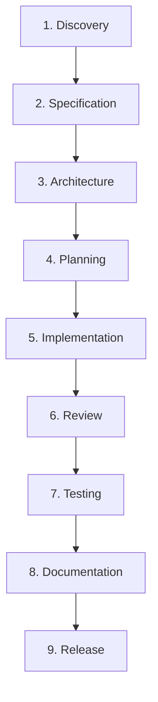

# Application Development Harness — Padrão de Engenharia Defendi

Repositório de especificação canônica, catálogo completo de perfis, templates reutilizáveis e ferramentas de governança para criação e manutenção do **Application Development Harness** nos projetos do ecossistema **Defendi**.

---

## 📌 Visão Geral

Coding agents frequentemente operam com instruções dispersas, gerando perda de contexto entre sessões, alucinações de requisitos, falta de rastreabilidade com tarefas de negócio (Jira) e ausência de critérios determinísticos de qualidade.

O **Application Development Harness** resolve esses problemas instituindo uma camada de engenharia persistente, auditável e padronizada. Ele transforma o desenvolvimento assistido por IA em um processo estruturado, guiado por especificações e com quality gates executáveis, garantindo que o ciclo de software seja executado com rigor profissional de ponta a ponta.

Este repositório atua como a **fonte da verdade (Single Source of Truth)** para a criação, manutenção e evolução dos harnesses em todos os projetos da organização.

---

## 📂 Estrutura e Catálogo do Repositório

O repositório disponibiliza uma suíte completa de artefatos de referência e ferramental de automação:

```text
.
├── Padrão Engenharia Harness.md    # Especificação formal de engenharia (SPEC-HARNESS-001 v2.0)
├── prompt.md                       # Master Prompt otimizado do Harness Engineer
├── README.md                       # Este guia de apresentação e governança
│
├── config/                         # Modelos canônicos de configuração
│   └── harness.yaml                # Template padrão com quality gates e integrações
│
├── templates/                      # Templates padronizados de artefatos de engenharia
│   ├── AGENTS.operational.md       # Template de .agents/AGENTS.md operacional
│   ├── specification.md            # Modelo de especificação técnica e funcional
│   ├── architecture.md             # Modelo de documento de arquitetura
│   ├── adr.md                      # Modelo de Architecture Decision Record
│   ├── implementation-plan.md      # Modelo de plano de implementação passo a passo
│   ├── test-plan.md                # Modelo de matriz e relatório de testes
│   ├── review.md                   # Modelo de relatório de code review
│   ├── release-notes.md            # Modelo de changelog e notas de versão
│   └── handoff.yaml                # Manifesto estruturado de transição entre agentes
│
├── rules/                          # Catálogo oficial de regras modulares (.agents/rules/)
│   ├── jira-card-lifecycle.md      # Ciclo de vida estrito e movimentação automática de cards Jira
│   ├── architecture.md             # Princípios arquiteturais e isolamento de segredos
│   ├── coding-standards.md         # Padrões de código, tipagem defensiva e linting
│   ├── testing.md                  # Tríade hermética de testes e isolamento de mocks
│   ├── security.md                 # Zero Trust, sanitização e isolamento de credenciais
│   ├── documentation.md            # Sincronização contínua de documentação técnica
│   ├── jira.md                     # Governança, rastreabilidade e taxonomia Jira
│   └── git.md                      # Padrões de branches, Conventional Commits e segurança
│
├── skills/                         # Catálogo oficial de habilidades modulares (.agents/skills/)
│   ├── requirements-analysis/      # Extração e validação de requisitos
│   ├── specification/              # Formalização de especificações funcionais
│   ├── architecture-design/        # Modelagem de sistemas e redação de ADRs
│   ├── implementation/             # Implementação orientada a testes (TDD)
│   ├── testing/                    # Execução da tríade hermética de testes
│   ├── code-review/                # Inspeção estática de código e apontamentos
│   ├── security-review/            # Auditoria de injeção e isolamento de credenciais
│   ├── jira-management/            # Transições e comentários pontuais no Jira
│   └── documentation/              # Manutenção de documentação sincronizada
│
├── workflows/                      # Workflows de ciclo de vida (.agents/workflows/)
│   ├── bootstrap.md                # Inicialização e setup do harness
│   ├── discovery.md                # Exploração do espaço do problema
│   ├── specification.md            # Formalização de requisitos
│   ├── architecture.md             # Desenho de módulos e ADRs
│   ├── planning.md                 # Planejamento atômico e transição para "A Fazer"
│   ├── implementation.md           # Desenvolvimento em feature branch
│   ├── review.md                   # Code Review estático e auditoria
│   ├── testing.md                  # Testes herméticos e validação QA
│   ├── documentation.md            # Sincronização de documentação
│   ├── release.md                  # Empacotamento, versionamento e tags
│   ├── full-cycle.md               # Ciclo contínuo de ponta a ponta
│   ├── quality-gates.md            # Execução de gates vinculados a comandos
│   └── harness-upgrade.md          # Procedimento seguro de atualização do harness
│
├── agents/                         # Catálogo de subagentes especializados (.agents/agents/)
│   ├── architect/AGENT.md          # Papel de Arquitetura e ADRs
│   ├── developer/AGENT.md          # Papel de Desenvolvimento e Testes Unitários
│   ├── tester/AGENT.md             # Papel de QA e Testes Herméticos
│   ├── reviewer/AGENT.md           # Papel de Code Review
│   ├── security/AGENT.md           # Papel de Segurança e Isolamento
│   ├── documentation/AGENT.md      # Papel de Integridade Documental
│   └── release/AGENT.md            # Papel de Versionamento e Entrega
│
├── adapters/                       # Adaptadores de Coding Agents (.agents/adapters/)
│   ├── claude/ADAPTER.md           # Adapter Claude Code
│   ├── gemini/ADAPTER.md           # Adapter Gemini / Antigravity
│   └── opencode/ADAPTER.md         # Adapter OpenCode
│
├── languages/                      # Catálogo oficial de Language Profiles
│   ├── python/                     # Python 3.12+, FastMCP, pip/uv, ruff, mypy, pytest
│   │   ├── PROFILE.md
│   │   ├── rules.md
│   │   ├── toolchain.md
│   │   └── language.yaml
│   ├── typescript/                 # pnpm, vitest, biome, tsc
│   │   ├── language.yaml
│   │   └── rules.md
│   └── go/                         # go test, golangci-lint, govulncheck
│       ├── language.yaml
│       └── rules.md
│
└── scripts/                        # Ferramental de automação e engenharia
    ├── harness-probe.py            # [NOVO] Sonda autônoma de ambiente e ferramentas
    ├── harness-init.py             # [NOVO] Motor de scaffolding em lote instantâneo
    ├── jira-setup.py               # [NOVO] Provisionador idempotente de projetos/workflows Jira
    └── harness-doctor.py           # [ATUALIZADO] Auditor de conformidade com 28 checagens
```

---

---

## 🤖 Como Operar: O Modelo de Agente Autônomo

O Application Development Harness foi projetado para que o desenvolvedor humano **não precise digitar comandos no terminal**. 

O **AI Coding Agent** (como o **Antigravity 2.0**, Claude Code ou Cursor) assume o papel de **Harness Engineer** e executa todas as ações operacionais através de suas ferramentas de sistema (`run_command`, `write_to_file`, etc.).

### Como Acionar o Agente:

1. Abra o chat com o seu AI Agent (ex: Antigravity 2.0);
2. Forneça as instruções do [**`prompt.md`**](./prompt.md) (Master Prompt);
3. Informe a sua intenção em linguagem natural:
   - *Exemplo Greenfield:* "Crie um novo projeto chamado McpSentinel para prover acesso seguro a ferramentas de infraestrutura."
   - *Exemplo Brownfield:* "Injete a governança do harness neste repositório existente sem alterar meu código."

O agente assume a condução completa de ponta a ponta.

---

## 🚀 Ciclos de Execução Autônoma pelo Agente

### 🟢 Cenário 1: Projetos Novos (Greenfield)

Quando você quer criar um novo projeto a partir de uma ideia ou pasta vazia:

* **O papel do Usuário:** Apenas conversa no chat, responde às poucas perguntas de alinhamento (stack desejada, nome do projeto, Jira Key) e aprova decisões de alto nível.
* **O que o Agente executa autonomamente (via ferramentas):**
  1. **Sonda de Ambiente:** O agente roda `python3 scripts/harness-probe.py --json` para descobrir interpretadores e ferramentas locais.
  2. **Provisionamento no GitHub:** O agente verifica a autenticação do `gh` e cria o repositório remoto privado via `gh repo create`.
  3. **Provisionamento no Jira Cloud:** O agente executa `python3 scripts/jira-setup.py` para criar o projeto e o workflow com os 8 status canônicos.
  4. **Geração do Harness:** O agente executa `python3 scripts/harness-init.py` e gera a árvore completa (`.agents/`, `docs/`, `AGENTS.md`, adapters, etc.) em menos de 1 segundo.
  5. **Auditoria com Doctor:** O agente roda `python3 scripts/harness-doctor.py` e valida 28/28 checagens com sucesso.
  6. **Ambiente e Testes:** O agente cria o virtualenv, instala dependências e executa os testes iniciais.
  7. **Commit & Push Inicial:** O agente realiza o commit semântico e faz o push para a branch `main` no GitHub.
  8. **Entrega Pronta:** O agente reporta os links do Jira e GitHub e deixa o projeto pronto para desenvolvimento.

---

### 🟡 Cenário 2: Projetos Já Existentes (Brownfield / Retrofit)

Quando você já possui um repositório com código de negócio, testes e histórico no Git, e deseja adotar o padrão Harness:

* **O papel do Usuário:** Fornece o caminho do repositório e pede a adoção do harness.
* **O que o Agente executa autonomamente (via ferramentas):**
  1. **Inspeção de Código Legado:** O agente examina a estrutura existente para identificar linguagem, framework e dependências.
  2. **Garantia de Preservação Absoluta:** O agente assegura que nenhum arquivo existente (`src/`, `tests/`, `package.json`, `pyproject.toml`, etc.) seja apagado ou alterado.
  3. **Injeção do Harness:** O agente roda `harness-init.py --target-dir <projeto>`, que injeta a governança (`.agents/`, `docs/`, `AGENTS.md`, adapters e atualiza o `.gitignore` de forma não-destrutiva).
  4. **Sincronização com o Jira:** O agente roda `jira-setup.py` para sincronizar os 8 status canônicos no Jira Cloud.
  5. **Auditoria de Conformidade:** O agente valida a integridade com `harness-doctor.py`.
  6. **Commit de Adoção & Push:** O agente comita as adições com `chore(harness): adopt application development harness v2.0` e envia ao GitHub.
  7. **Entrega Pronta:** O repositório passa a operar com o ciclo de vida governado sem nenhuma quebra no código de negócio pré-existente.

---

## 🛠️ Toolkit Interno do Agente (`scripts/`)

Os scripts sob `scripts/` formam o **motor de execução autônoma** utilizado pelo Agente para realizar o trabalho pesado em frações de segundo. Eles também podem ser invocados manualmente por engenheiros ou pipelines de CI/CD:

| Utilitário | Finalidade | Como o Agente Executa |
|:---|:---|:---|
| **`harness-probe.py`** | Sonda de interpretadores, `gh auth` e Jira tokens. | `python3 scripts/harness-probe.py --json` |
| **`harness-init.py`** | Scaffolding em lote instantâneo (< 1s, não-destrutivo). | `python3 scripts/harness-init.py --target-dir <dir> ...` |
| **`jira-setup.py`** | Provisionador idempotente de projetos e workflows Jira. | `python3 scripts/jira-setup.py --domain <dom> --key <key> ...` |
| **`harness-doctor.py`** | Auditor de conformidade com 28 checagens estritas. | `python3 scripts/harness-doctor.py <dir>` |

---

## 🏛️ Princípios Arquiteturais Centrais

1. **Separação entre Contrato e Implementação:**
   - O contrato operacional público reside no arquivo raiz `AGENTS.md`.
   - A infraestrutura interna (regras, skills, workflows, templates, agents) reside sob `.agents/`.
2. **Language Agnostic (Agnóstico a Linguagem):**
   - O core do harness não assume tecnologias. Cada projeto conecta seu perfil a partir do catálogo `languages/`.
3. **Agent & LLM Agnostic:**
   - Neutralidade absoluta de provedores. Adaptadores como `CLAUDE.md` e `GEMINI.md` apenas traduzem a descoberta e apontam para `AGENTS.md`.
4. **Gate Estrito de Papéis:**
   - O agente principal atua **exclusivamente como orquestrador** e despachante. Não inspeciona código para programar diretamente.
   - Implementação vai para `developer`, revisão para `reviewer`, testes para `tester`.
5. **Estado Persistente (Persistent State):**
   - Todo conhecimento, decisão arquitetural (ADR) e plano de teste reside em arquivos versionados em `docs/`.
6. **Quality Gates Executáveis:**
   - A transição de status exige o sucesso determinístico (exit code `0`) da tríade hermética (linter, tipagem e testes).

---

## 🔁 Ciclo de Vida da Engenharia (Full Cycle)



---

## 📋 Regras de Movimentação dos Cards no Jira

```text
Backlog (10012) ➔ A Fazer (10057) ➔ Em Andamento (3) ➔ Pronto para Review (10099) ➔ Review (10100) ➔ Pronto Para Testar (10101) ➔ Testando (10102) ➔ Concluído (10011)
```
- **Rejeição no Review:** comentários individuais pontuais no card e retorno imediato para `A Fazer`.
- **Rejeição no QA:** comentários individuais pontuais no card e retorno imediato para `A Fazer`.
- **Aprovação com Sugestões:** avança para o próximo estágio e sugestões viram novos cards em `Backlog`.
