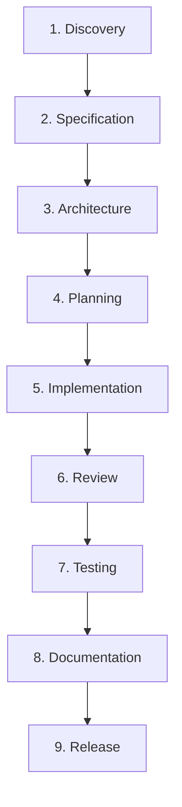

# Application Development Harness — Padrão de Engenharia Defendi

Repositório de especificação canônica, catálogo completo de perfis, templates reutilizáveis e ferramentas de governança para criação e manutenção do **Application Development Harness** nos projetos do ecossistema **Defendi**.

---

## 📌 Visão Geral

Coding agents frequentemente operam com instruções dispersas, gerando perda de contexto entre sessões, alucinações de requisitos, falta de rastreabilidade com tarefas de negócio (Jira) e ausência de critérios determinísticos de qualidade.

O **Application Development Harness** resolve esses problemas instituindo uma camada de engenharia persistente, auditável e padronizada. Ele transforma o desenvolvimento assistido por IA em um processo estruturado, guiado por especificações e com quality gates executáveis, garantindo que o ciclo de software seja executado com rigor profissional de ponta a ponta.

Este repositório atua como a **fonte da verdade (Single Source of Truth)** para a criação, manutenção e evolução dos harnesses em todos os projetos da organização.

---

## 📂 Estrutura e Catálogo do Repositório

O repositório disponibiliza uma suíte completa de artefatos de referência e ferramental de automação:

```text
.
├── Padrão Engenharia Harness.md    # Especificação formal de engenharia (SPEC-HARNESS-001 v2.0)
├── prompt.md                       # Master Prompt otimizado do Harness Engineer
├── README.md                       # Este guia de apresentação e governança
│
├── config/                         # Modelos canônicos de configuração
│   └── harness.yaml                # Template padrão com quality gates e integrações
│
├── templates/                      # Templates padronizados de artefatos de engenharia
│   ├── AGENTS.operational.md       # Template de .agents/AGENTS.md operacional
│   ├── specification.md            # Modelo de especificação técnica e funcional
│   ├── architecture.md             # Modelo de documento de arquitetura
│   ├── adr.md                      # Modelo de Architecture Decision Record
│   ├── implementation-plan.md      # Modelo de plano de implementação passo a passo
│   ├── test-plan.md                # Modelo de matriz e relatório de testes
│   ├── review.md                   # Modelo de relatório de code review
│   ├── release-notes.md            # Modelo de changelog e notas de versão
│   └── handoff.yaml                # Manifesto estruturado de transição entre agentes
│
├── rules/                          # Catálogo oficial de regras modulares (.agents/rules/)
│   ├── jira-card-lifecycle.md      # Ciclo de vida estrito e movimentação automática de cards Jira
│   ├── architecture.md             # Princípios arquiteturais e isolamento de segredos
│   ├── coding-standards.md         # Padrões de código, tipagem defensiva e linting
│   ├── testing.md                  # Tríade hermética de testes e isolamento de mocks
│   ├── security.md                 # Zero Trust, sanitização e isolamento de credenciais
│   ├── documentation.md            # Sincronização contínua de documentação técnica
│   ├── jira.md                     # Governança, rastreabilidade e taxonomia Jira
│   └── git.md                      # Padrões de branches, Conventional Commits e segurança
│
├── skills/                         # Catálogo oficial de habilidades modulares (.agents/skills/)
│   ├── requirements-analysis/      # Extração e validação de requisitos
│   ├── specification/              # Formalização de especificações funcionais
│   ├── architecture-design/        # Modelagem de sistemas e redação de ADRs
│   ├── implementation/             # Implementação orientada a testes (TDD)
│   ├── testing/                    # Execução da tríade hermética de testes
│   ├── code-review/                # Inspeção estática de código e apontamentos
│   ├── security-review/            # Auditoria de injeção e isolamento de credenciais
│   ├── jira-management/            # Transições e comentários pontuais no Jira
│   └── documentation/              # Manutenção de documentação sincronizada
│
├── workflows/                      # Workflows de ciclo de vida (.agents/workflows/)
│   ├── bootstrap.md                # Inicialização e setup do harness
│   ├── discovery.md                # Exploração do espaço do problema
│   ├── specification.md            # Formalização de requisitos
│   ├── architecture.md             # Desenho de módulos e ADRs
│   ├── planning.md                 # Planejamento atômico e transição para "A Fazer"
│   ├── implementation.md           # Desenvolvimento em feature branch
│   ├── review.md                   # Code Review estático e auditoria
│   ├── testing.md                  # Testes herméticos e validação QA
│   ├── documentation.md            # Sincronização de documentação
│   ├── release.md                  # Empacotamento, versionamento e tags
│   ├── full-cycle.md               # Ciclo contínuo de ponta a ponta
│   ├── quality-gates.md            # Execução de gates vinculados a comandos
│   └── harness-upgrade.md          # Procedimento seguro de atualização do harness
│
├── agents/                         # Catálogo de subagentes especializados (.agents/agents/)
│   ├── architect/AGENT.md          # Papel de Arquitetura e ADRs
│   ├── developer/AGENT.md          # Papel de Desenvolvimento e Testes Unitários
│   ├── tester/AGENT.md             # Papel de QA e Testes Herméticos
│   ├── reviewer/AGENT.md           # Papel de Code Review
│   ├── security/AGENT.md           # Papel de Segurança e Isolamento
│   ├── documentation/AGENT.md      # Papel de Integridade Documental
│   └── release/AGENT.md            # Papel de Versionamento e Entrega
│
├── adapters/                       # Adaptadores de Coding Agents (.agents/adapters/)
│   ├── claude/ADAPTER.md           # Adapter Claude Code
│   ├── gemini/ADAPTER.md           # Adapter Gemini / Antigravity
│   └── opencode/ADAPTER.md         # Adapter OpenCode
│
├── languages/                      # Catálogo oficial de Language Profiles
│   ├── python/                     # Python 3.12+, FastMCP, pip/uv, ruff, mypy, pytest
│   │   ├── PROFILE.md
│   │   ├── rules.md
│   │   ├── toolchain.md
│   │   └── language.yaml
│   ├── typescript/                 # pnpm, vitest, biome, tsc
│   │   ├── language.yaml
│   │   └── rules.md
│   └── go/                         # go test, golangci-lint, govulncheck
│       ├── language.yaml
│       └── rules.md
│
└── scripts/                        # Ferramental de automação e engenharia
    ├── harness-probe.py            # [NOVO] Sonda autônoma de ambiente e ferramentas
    ├── harness-init.py             # [NOVO] Motor de scaffolding em lote instantâneo
    ├── jira-setup.py               # [NOVO] Provisionador idempotente de projetos/workflows Jira
    └── harness-doctor.py           # [ATUALIZADO] Auditor de conformidade com 28 checagens
```

---

## 🛠️ Ferramental de Engenharia (`scripts/`)

O repositório disponibiliza utilitários autônomos para acelerar o setup e a governança:

### 1. Sonda de Ambiente (`harness-probe.py`)
Inspeciona o ambiente local antes do bootstrap para identificar interpretadores, gerenciadores de pacotes e status de autenticação:
```bash
python3 scripts/harness-probe.py
# Ou para consumo programático em JSON:
python3 scripts/harness-probe.py --json
```

### 2. Inicializador em Lote (`harness-init.py`)
Gera o esqueleto completo do Application Development Harness em **menos de 1 segundo**, eliminando a necessidade de dezenas de tool calls lentas de LLM:
```bash
python3 scripts/harness-init.py \
  --target-dir /caminho/do/projeto \
  --project-name "McpSentinel" \
  --description "Servidor MCP para acesso controlado à infraestrutura" \
  --language python \
  --framework FastMCP \
  --jira-key MCPS \
  --jira-domain "mygotryx.atlassian.net" \
  --jira-user "usuario@empresa.com" \
  --github-repo "org/McpSentinel"
```

### 3. Provisionador Jira Cloud (`jira-setup.py`)
Cria o projeto no Jira Cloud via REST API v3, configura os 8 status canônicos e associa o Workflow Scheme oficial de forma idempotente:
```bash
python3 scripts/jira-setup.py \
  --domain "seu-dominio.atlassian.net" \
  --user "seu-email@dominio.com" \
  --token-file "token_jira.txt" \
  --project-key "MCPS" \
  --project-name "McpSentinel"
```

### 4. Auditor de Sanidade (`harness-doctor.py`)
Valida a integridade completa de qualquer projeto com 28 checagens estritas:
```bash
python3 scripts/harness-doctor.py /caminho/do/projeto
```

---

## 🚀 Como Executar o Gerador de Harness

O gerador foi projetado para operar tanto na criação de novos sistemas do zero quanto na injeção de governança em bases de código legadas.

### 🟢 Cenário 1: Projetos Novos (Greenfield)
Utilize quando estiver iniciando um novo repositório ou pasta vazia:

```bash
# 1. Inspecione o ambiente (opcional, para conferir interpretadores e ferramentas)
python3 scripts/harness-probe.py

# 2. Provisione o projeto no Jira Cloud com os 8 status canônicos
python3 scripts/jira-setup.py \
  --domain "seu-dominio.atlassian.net" \
  --user "seu-email@dominio.com" \
  --token-file "token_jira.txt" \
  --project-key "PROJ" \
  --project-name "NovoProjeto"

# 3. Gere o esqueleto completo do Harness (< 1 segundo)
python3 scripts/harness-init.py \
  --target-dir /caminho/do/novo-projeto \
  --project-name "NovoProjeto" \
  --description "Descrição do novo sistema" \
  --language python \
  --framework FastMCP \
  --jira-key PROJ \
  --jira-domain "seu-dominio.atlassian.net" \
  --jira-user "seu-email@dominio.com" \
  --github-repo "org/novo-projeto"

# 4. Audite a conformidade com o Harness Doctor (deve retornar 28/28 OK)
python3 scripts/harness-doctor.py /caminho/do/novo-projeto

# 5. Inicialize o repositório Git e faça o primeiro push
cd /caminho/do/novo-projeto
git init -b main
git remote add origin https://github.com/org/novo-projeto.git
git add .
git commit -m "feat(harness): initialize application development harness"
git push -u origin main
```

---

### 🟡 Cenário 2: Projetos Já Existentes (Brownfield / Retrofit)
Utilize quando o projeto **já possui código de negócio, testes e histórico no Git**, e você deseja adotar o padrão de engenharia do Harness sem risco de sobrescrita.

> **Garantia de Preservação:** O `harness-init.py` é estritamente **não-destrutivo**. Se arquivos como `pyproject.toml`, `package.json`, `go.mod`, pastas `src/` ou suítes de testes já existirem, eles são **100% preservados**. O gerador apenas adiciona a camada de governança:
> - Infraestrutura `.agents/` (regras, skills, workflows, agents, templates, adapters e configs).
> - Taxonomia de documentação persistente `docs/` (`specs/`, `architecture/`, `decisions/`, etc.).
> - Contratos raiz: `AGENTS.md`, `CLAUDE.md`, `GEMINI.md`.
> - Proteções de segurança no `.gitignore` (sem apagar suas regras existentes).

```bash
# 1. Inspecione o ambiente a partir da raiz do repositório
python3 /caminho/do/harness/scripts/harness-probe.py

# 2. Execute o inicializador apontando para a pasta do projeto existente
python3 /caminho/do/harness/scripts/harness-init.py \
  --target-dir /caminho/do/projeto-existente \
  --project-name "ProjetoExistente" \
  --description "Sistema de pagamentos em produção" \
  --language python \
  --framework Django \
  --jira-key PAG \
  --jira-domain "seu-dominio.atlassian.net" \
  --jira-user "seu-email@dominio.com" \
  --github-repo "org/projeto-existente"

# 3. Provisione ou sincronize o workflow no Jira Cloud (idempotente)
python3 /caminho/do/harness/scripts/jira-setup.py \
  --domain "seu-dominio.atlassian.net" \
  --user "seu-email@dominio.com" \
  --token-file "token_jira.txt" \
  --project-key "PAG" \
  --project-name "ProjetoExistente"

# 4. Audite a conformidade
python3 /caminho/do/harness/scripts/harness-doctor.py /caminho/do/projeto-existente

# 5. Realize o commit de adoção da governança do Harness
cd /caminho/do/projeto-existente
git add .agents docs AGENTS.md CLAUDE.md GEMINI.md .gitignore
git commit -m "chore(harness): adopt application development harness v2.0"
git push origin main
```

---

## 🏛️ Princípios Arquiteturais Centrais

1. **Separação entre Contrato e Implementação:**
   - O contrato operacional público reside no arquivo raiz `AGENTS.md`.
   - A infraestrutura interna (regras, skills, workflows, templates, agents) reside sob `.agents/`.
2. **Language Agnostic (Agnóstico a Linguagem):**
   - O core do harness não assume tecnologias. Cada projeto conecta seu perfil a partir do catálogo `languages/`.
3. **Agent & LLM Agnostic:**
   - Neutralidade absoluta de provedores. Adaptadores como `CLAUDE.md` e `GEMINI.md` apenas traduzem a descoberta e apontam para `AGENTS.md`.
4. **Gate Estrito de Papéis:**
   - O agente principal atua **exclusivamente como orquestrador** e despachante. Não inspeciona código para programar diretamente.
   - Implementação vai para `developer`, revisão para `reviewer`, testes para `tester`.
5. **Estado Persistente (Persistent State):**
   - Todo conhecimento, decisão arquitetural (ADR) e plano de teste reside em arquivos versionados em `docs/`.
6. **Quality Gates Executáveis:**
   - A transição de status exige o sucesso determinístico (exit code `0`) da tríade hermética (linter, tipagem e testes).

---

## 🔁 Ciclo de Vida da Engenharia (Full Cycle)



---

## 📋 Regras de Movimentação dos Cards no Jira

```text
Backlog (10012) ➔ A Fazer (10057) ➔ Em Andamento (3) ➔ Pronto para Review (10099) ➔ Review (10100) ➔ Pronto Para Testar (10101) ➔ Testando (10102) ➔ Concluído (10011)
```
- **Rejeição no Review:** comentários individuais pontuais no card e retorno imediato para `A Fazer`.
- **Rejeição no QA:** comentários individuais pontuais no card e retorno imediato para `A Fazer`.
- **Aprovação com Sugestões:** avança para o próximo estágio e sugestões viram novos cards em `Backlog`.
