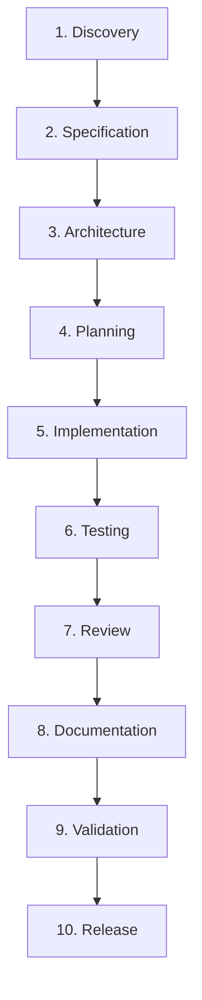

# Application Development Harness — Padrão de Engenharia Defendi

Repositório de especificação canônica e geração de **Application Development Harness** para padronização do ciclo de engenharia de software orientado a agentes de Inteligência Artificial nos projetos do ecossistema **Defendi**.

---

## 📌 Visão Geral

Coding agents frequentemente sofrem com perda de contexto entre sessões, alucinações de requisitos, falta de rastreabilidade com tarefas de negócio (Jira) e dependência excessiva de instruções dispersas.

O **Application Development Harness** resolve esses problemas instituindo uma camada de engenharia persistente, auditável e padronizada. Ele transforma o desenvolvimento assistido por IA em um processo estruturado, guiado por especificações e com quality gates explícitos, garantindo que o ciclo de software seja executado com rigor profissional.

Este repositório serve como a **fonte da verdade (Single Source of Truth)** para a criação e governança dos harnesses em todos os projetos do Defendi.

---

## 📂 O Que Existe Hoje no Repositório

Atualmente, este repositório é composto pelos seguintes artefatos fundamentais:

| Arquivo | Descrição | Papel |
| :--- | :--- | :--- |
| [`Padrão Engenharia Harness.md`](./Padrão%20Engenharia%20Harness.md) | **Especificação Formal de Engenharia (`SPEC-HARNESS-001`)**<br>Documento exaustivo (40 seções) que estabelece princípios arquiteturais, ciclo de vida, estrutura de diretórios, separação entre contrato canônico e implementação, papéis de agentes, quality gates, rastreabilidade Jira e requisitos funcionais/não-funcionais. | **Especificação & Governança** |
| [`prompt.md`](./prompt.md) | **Master Prompt Executável do Harness Engineer**<br>Instrução completa e detalhada destinada aos coding agents (Claude Code, Gemini/Antigravity, OpenCode, etc.) para realizar o bootstrap interativo, entrevistar o usuário, inspecionar o repositório-alvo e gerar a infraestrutura completa do harness customizada para o projeto. | **Motor de Bootstrap / Execução** |

---

## 🏛️ Princípios Arquiteturais Centrais

1. **Separação entre Contrato e Implementação:**
   - O contrato operacional público reside no arquivo raiz `AGENTS.md`.
   - A implementação interna, regras, skills e templates residem sob o diretório `.agents/`.
2. **Language Agnostic (Agnóstico a Linguagem):**
   - O core do harness não presume tecnologias (não assume Python, Go, Node, etc.).
   - As especificidades de cada linguagem são encapsuladas em perfis isolados (`.agents/languages/<linguagem>/`).
3. **Agent & LLM Agnostic:**
   - O core opera de forma neutra em relação ao fornecedor ou modelo.
   - Adaptadores de ferramentas (`CLAUDE.md`, `GEMINI.md`, etc.) apenas traduzem a descoberta e apontam para o contrato canônico `AGENTS.md`.
4. **Specification Driven (Orientado a Especificações):**
   - Toda mudança significativa parte de um requisito rastreado (Jira) e de uma especificação formal documentada. Não se desenvolve código a partir do nada.
5. **Estado Persistente (Persistent State):**
   - As decisões arquiteturais (ADRs), planos de execução, especificações e resultados de testes residem em arquivos versionados no repositório (`docs/` e `.agents/`), nunca exclusivamente na memória volátil da conversa.
6. **Política de Mudança Segura (Safe Change Policy):**
   - Fluxo obrigatório: `READ → UNDERSTAND → PLAN → MODIFY → TEST → REVIEW`.
   - Proibição de comandos destrutivos não autorizados (`git reset --hard`, `git push --force`) e de credenciais/secrets em texto puro.

---

## 🔄 Arquitetura do Harness Gerado

Quando o harness é instanciado em um projeto Defendi, ele cria a seguinte estrutura padrão:

```text
/
├── AGENTS.md                   # Contrato canônico de operação dos agentes
├── CLAUDE.md                   # Adapter para Claude Code (aponta para AGENTS.md)
├── GEMINI.md                   # Adapter para Gemini / Antigravity
├── README.md                   # Apresentação do projeto e comandos úteis
│
├── .agents/                    # Implementação interna do Harness
│   ├── AGENTS.md               # Como interpretar e carregar recursos do harness
│   ├── config/
│   │   ├── harness.yaml        # Configuração do projeto, Jira e gates
│   │   └── language.yaml       # Configuração da toolchain da linguagem
│   ├── rules/                  # Regras modulares (git, jira, testing, security, etc.)
│   ├── skills/                 # Procedimentos padronizados e operacionais
│   ├── workflows/              # Fluxos executáveis (bootstrap, feature, review, etc.)
│   ├── agents/                 # Definições de papéis especializados
│   ├── templates/              # Modelos de spec, ADR, plano de teste, etc.
│   ├── languages/
│   │   └── <linguagem>/        # Profile específico da linguagem adotada
│   └── adapters/               # Adapters específicos de fornecedores de agentes
│
└── docs/                       # Documentação persistente do projeto
    ├── specs/                  # Especificações funcionais e técnicas
    ├── architecture/           # Desenho arquitetural e diagramas
    ├── decisions/              # Architecture Decision Records (ADRs)
    ├── execution/              # Planos de implementação e relatórios de review
    └── references/             # Documentação externa de apoio e contexto
```

---

## 🔁 Ciclo de Vida da Engenharia (Full Cycle)

O harness governa o fluxo de entrega de ponta a ponta através de 10 fases ordenadas com seus respectivos quality gates:



### Rastreabilidade Ponta a Ponta com Jira
Nenhum artefato existe isoladamente. A rastreabilidade é garantida em todas as etapas:

$$\text{Jira Issue} \longrightarrow \text{Specification} \longrightarrow \text{Architecture / ADR} \longrightarrow \text{Plan} \longrightarrow \text{Code} \longrightarrow \text{Tests} \longrightarrow \text{Review} \longrightarrow \text{Release}$$

---

## 👥 Especialização de Papéis (Subagentes)

O harness define papéis com responsabilidades estritas para evitar conflito de interesses e perda de contexto:

* **Orquestrador (Agente Principal):** Atua como coordenador de sessão, gestor de status e comentários no Jira e despachante de subagentes. Não implementa código diretamente.
* **Architect:** Responsável por análise de requisitos, decomposição em módulos, desenho técnico, análise de riscos e elaboração de ADRs.
* **Developer:** Responsável pela escrita de código limpo, cobertura de testes unitários e cumprimento integral da especificação.
* **Tester:** Responsável pela estratégia de testes (herméticos, integração, carga), execução de suítes e validação de regressões.
* **Reviewer:** Responsável por code review rigoroso, detecção de bugs residuais, qualidade de design e aderência ao padrão.
* **Security:** Responsável por checagem de vulnerabilidades, boas práticas de autenticação, ausência de credenciais expostas e auditoria de dependências.
* **Documentation:** Responsável por manter documentações, specs e guias sincronizados com a realidade do código.
* **Release:** Responsável por changelogs, versionamento semântico, validação de empacotamento e tags de release.

---

## 🚀 Como Aplicar o Harness em um Projeto

Para aplicar o padrão de harness em um novo projeto ou em um projeto legado do Defendi:

1. **Abra o repositório de destino** na sua IDE ou ambiente de IA (Claude Code, Gemini/Antigravity, Cursor, etc.).
2. **Execute o Master Prompt:**
   - Forneça o conteúdo do arquivo [`prompt.md`](./prompt.md) ao agente.
3. **Responda à Entrevista de Bootstrap (obrigatória):**
   - **Descrição do Projeto:** o que o sistema faz, quem usa e qual problema resolve.
   - **Linguagem Principal:** linguagem alvo (Python, Go, Java, TypeScript, C++, etc.). *O agente nunca assumirá Python por padrão*.
   - **Espaço e Credenciais Jira:** espaço no Jira, domínio Atlassian e identificação do projeto para rastreabilidade.
   - **Repositório GitHub:** usuário/organização e nome do repositório.
4. **Inspeção Adaptativa:**
   - O agente inspecionará o projeto para detectar gerenciadores de pacote, frameworks existentes e suítes de teste, preservando configurações existentes sem sobrescritas silenciosas.
5. **Geração e Validação:**
   - O agente criará a estrutura `.agents/`, `docs/`, `AGENTS.md` e adaptadores correspondentes com validação final de sanidade.

---

## 🛠️ Contribuindo e Evoluindo o Padrão

- **Aprimoramentos de Especificação:** Devem ser discutidos e registrados em [`Padrão Engenharia Harness.md`](./Padrão%20Engenharia%20Harness.md).
- **Aprimoramentos Operacionais do Prompt:** Devem ser refletidos em [`prompt.md`](./prompt.md), garantindo sincronia entre o que a especificação prescreve e o que o prompt executa.
- **Novas Linguagens & Ferramentas:** Novos profiles e adapters devem ser projetados para acoplamento plug-and-play sem alterar o core conceitual.
