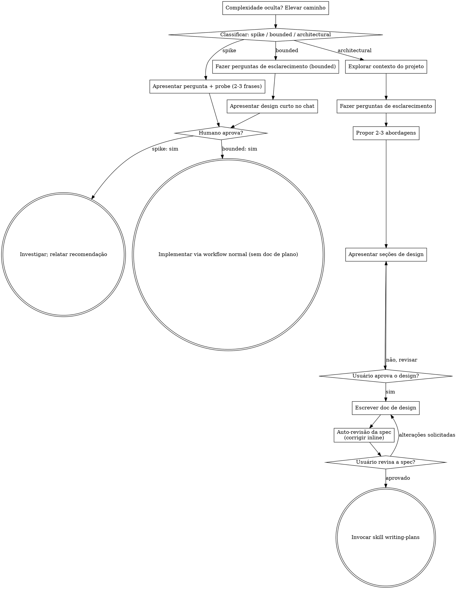

# Transformando Ideias em Designs com Brainstorming

Ajude a transformar ideias em designs e especificações totalmente formulados por meio de um diálogo colaborativo natural.

Comece classificando quanto processo a solicitação exige e, em seguida, percorra o seu caminho: entenda o contexto, refine a ideia, apresente um design e obtenha a aprovação do seu parceiro humano.

## Estabeleça um Entendimento Compartilhado

O resultado do brainstorming é um entendimento que seu parceiro humano possa reconhecer e corrigir, fundamentado no que ele deseja realizar.

1. **Descubra a intenção.** Use a solicitação e o contexto disponível para identificar o resultado pretendido, para quem se destina e como é o sucesso. Quando essas informações estiverem faltando, faça uma pergunta focada sobre o propósito ou o uso pretendido antes de propor features ou uma abordagem. Conhecer o gênero do aplicativo não diz por que seu parceiro o deseja. Reunir requisitos ausentes não significa pedir para autorizarem a tarefa novamente.
2. **Registre seu entendimento.** Resuma o resultado pretendido, restrições relevantes e critérios de sucesso em uma nota curta que seu parceiro possa avaliar. Separe o que ele disse das suposições. Peça correções e incorpore a resposta dele antes de tratar isso como o brief de design.
3. **Leve a intenção para o design.** Preserve o entendimento acordado no artefato de design do caminho selecionado: a spec escrita para trabalho arquitetural, ou o design/probe no chat para trabalho bounded e spikes. Verifique as features propostas e as escolhas técnicas em relação a esse entendimento.

Quando a solicitação já fornecer o propósito e as restrições, reflita esse entendimento em vez de fazer as mesmas perguntas novamente. Mantenha a nota concisa; a precisão dela e a oportunidade de corrigi-la são o que importa.

<HARD-GATE>
Antes de tomar qualquer ação de implementação, incluindo invocar uma skill de implementação, escrever código de produto, scaffolding, instalar dependências de produto ou criar um projeto externo, conclua os pré-requisitos do caminho selecionado:

- Spike: o parceiro humano aprova a pergunta e o probe.
- Bounded: o parceiro humano aprova o design curto no chat.
- Architectural: o parceiro humano revisa e aprova a spec escrita, depois revisa o plano de implementação escrito e seleciona seu método de execução. A aprovação conversacional do design apenas permite escrever a spec; a aprovação da spec escrita apenas permite invocar writing-plans.

Uma resposta aprova o estágio efetivamente apresentado. A aprovação de uma ideia ou do escopo de uma feature não aprova artefatos que ainda não existem. Retome no estágio incompleto mais anterior; não transforme uma aprovação em permissão para pular o restante do caminho selecionado. A exploração do projeto em modo somente leitura (read-only) é permitida enquanto esses pré-requisitos permanecerem incompletos.
</HARD-GATE>

## Três Caminhos

Antes da sua primeira pergunta, classifique a solicitação e diga a classificação em voz alta — "isso parece bounded, então vou apresentar um design curto aqui em vez de escrever uma spec" — para que seu parceiro humano possa sobrescrevê-la:

- **Spike** — uma questão de viabilidade ("podemos...", "é possível...", "rápido e improvisado está ótimo") cujo resultado é uma resposta, não um código que você mantém. Apresente a pergunta e o que você vai testar em 2-3 frases, obtenha uma confirmação e, em seguida, descubra com o menor custo que a correção permitir. Sem documento de design, sem arquivo de spec. Relate as descobertas como uma recomendação; qualquer coisa construída permanece rotulada como descartável (throwaway).
- **Bounded** — uma alteração de escopo bem definido em código que já existe neste repo: uma nova flag, um endpoint pequeno, uma correção em arquivo único. Entender o tipo de aplicativo não é suficiente — bounded significa que o fluxo que você está alterando já está aqui para ser lido. Se não houver um fluxo existente para alterar, a tarefa não é bounded. Faça as perguntas de esclarecimento que importam, apresente um design curto NO CHAT (de algumas frases a poucos parágrafos curtos) e PARE. A implementação só começa depois que seu parceiro humano disser "sim" para esse design — a aprovação de uma tarefa bounded é um hard-gate tão rigoroso quanto o de uma arquitetural. Sem arquivo de spec, sem documento de plano de implementação.
- **Architectural** — novos projetos, novos subsistemas, alterações que reestruturam como os componentes se encaixam ou alteram interfaces das quais outros dependem. Siga o processo completo: perguntas, abordagens, design em seções, spec escrita e, em seguida, a skill writing-plans.

Em caso de dúvida entre dois caminhos, escolha o mais pesado. A catraca é de mão única: a complexidade oculta descoberta no meio da tarefa eleva o caminho — pare, avise e suba de nível. Nada é rebaixado no meio da tarefa.

## Anti-Pattern: "Simples Demais Para Precisar de Aprovação"

Todo caminho termina com seu parceiro humano aprovando o design exigido antes da implementação. Uma alteração bounded pode precisar de apenas duas frases no chat. Um novo projeto de lista de tarefas (todo-list) é arquitetural e exige a spec escrita e os handoffs de planejamento. Dimensione o artefato de acordo com o caminho selecionado; conclua as revisões desse caminho antes da implementação.

## Red Flags

| Pensamento | Realidade |
|---------|---------|
| "Isso é simples demais para precisar de um design" | Siga o caminho selecionado: uma alteração bounded recebe um design curto no chat; uma alteração arquitetural recebe a spec escrita e os handoffs de planejamento. |
| "Vou chamar de bounded e pular a spec" | Buscar um rótulo para pular etapas É a própria dúvida — escolha o caminho mais pesado. |
| "É bounded e o design é óbvio — vou começar enquanto eles leem" | O gate é a aprovação, não o tamanho do design. Apresente e depois pare até ouvir um sim. |
| "Eu entendo esse tipo de app, então é bounded" | Bounded mede o repo, não a sua familiaridade. Um novo projeto não tem fluxo existente — ele é arquitetural. |
| "O spike funcionou, então vou manter o código" | O resultado de um spike é uma resposta. Manter o código é uma nova solicitação — classifique-a. |
| "Cresceu, mas já estou quase terminando — não precisa reclassificar" | Complexidade oculta eleva o caminho no meio da tarefa. Pare e avise. |
| "Eles aprovaram o spike, então a alteração seguinte também está aprovada" | Cada tarefa recebe sua própria classificação e sua própria aprovação. |

## Checklist

Classifique primeiro, anuncie o caminho, depois crie uma tarefa para cada item em seu caminho e conclua-os em ordem.

**Spike:**
1. **Explorar o contexto do projeto** — o suficiente para estruturar o probe
2. **Apresentar a pergunta + plano de probe** — 2-3 frases
3. **Obter aprovação** — uma confirmação simples é suficiente
4. **Investigar** — com o menor custo que a correção permitir
5. **Relatar descobertas** — uma recomendação; rotule qualquer coisa construída como descartável

**Bounded:**
1. **Explorar o contexto do projeto** — verificar arquivos, documentação, commits recentes
2. **Fazer perguntas de esclarecimento** — uma de cada vez, apenas as que importam
3. **Apresentar design curto no chat** — abordagem, arquivos afetados, testes
4. **Obter aprovação** — PARE e espere por um sim explícito; apresentar o design e começar no mesmo instante é pular o gate
5. **Implementar** — prosseguir com o workflow normal de desenvolvimento (TDD se aplica); sem documento de plano

**Architectural:**
1. **Explorar o contexto do projeto** — verificar arquivos, documentação, commits recentes
2. **Oferecer o visual companion just-in-time** — NÃO antecipadamente. Na primeira vez em que uma pergunta for genuinamente mais clara sendo exibida do que descrita, ofereça-o naquele momento (em uma mensagem própria); com a aprovação, a aba do navegador dele se abre para você. Se nenhuma questão visual surgir, nunca o ofereça. Veja a seção Visual Companion abaixo.
3. **Fazer perguntas de esclarecimento** — uma de cada vez, compreenda o propósito/restrições/critérios de sucesso
4. **Propor 2-3 abordagens** — com trade-offs e sua recomendação
5. **Apresentar o design** — em seções dimensionadas de acordo com sua complexidade, obtenha a aprovação do usuário após cada seção
6. **Escrever o doc de design** — salvar em `docs/superpowers/specs/YYYY-MM-DD-<topic>-design.md` e fazer o commit
7. **Auto-revisão da spec** — checagem rápida inline de placeholders, contradições, ambiguidade e escopo (veja abaixo)
8. **Usuário revisa a spec escrita** — pedir ao usuário para revisar o arquivo de spec antes de prosseguir
9. **Transição para a implementação** — invocar a skill writing-plans para criar o plano de implementação

## Fluxo do Processo

**Os estados terminais são vinculados ao caminho.** Architectural: a ÚNICA skill que você invoca após o brainstorming é writing-plans — nunca frontend-design, mcp-builder ou qualquer outra skill de implementação. Bounded: após a aprovação, a implementação prossegue diretamente através do workflow normal de desenvolvimento; sem documento de plano. Spike: o estado terminal é uma recomendação relatada.

## O Processo

As subseções abaixo atendem aos caminhos bounded e architectural (um spike termina em "apresentar o probe, obter uma confirmação"). As seções a partir de **Explorando abordagens** em diante são aprofundamentos do caminho architectural — para trabalho bounded, o contexto mais algumas perguntas e um design curto no chat constituem todo o processo.

**Entendendo a ideia:**

- Verifique primeiro o estado atual do projeto (arquivos, documentação, commits recentes)
- Antes de fazer perguntas detalhadas, avalie o escopo: se a solicitação descrever múltiplos subsistemas independentes (por exemplo, "construir uma plataforma com chat, armazenamento de arquivos, faturamento e analytics"), aponte isso imediatamente. Não gaste perguntas refinando detalhes de um projeto que precisa ser decomposto primeiro.
- Se o projeto for grande demais para uma única spec, ajude o usuário a decompô-lo em subprojetos: quais são as partes independentes, como elas se relacionam, em que ordem devem ser construídas? Em seguida, faça o brainstorming do primeiro subprojeto através do fluxo normal de design. Cada subprojeto recebe seu próprio ciclo de spec → plan → implementation.
- Para projetos com escopo adequado, faça perguntas uma de cada vez para refinar a ideia
- Dê preferência a perguntas de múltipla escolha quando possível, mas perguntas abertas também são aceitáveis
- Apenas uma pergunta por mensagem - se um tópico precisar de mais exploração, divida-o em várias perguntas
- Foque em compreender: propósito, restrições, critérios de sucesso

**Explorando abordagens:**

- Proponha 2-3 abordagens diferentes com trade-offs
- Apresente opções de forma conversacional com sua recomendação e justificativa
- Comece com a opção recomendada e explique o porquê
- Aplique YAGNI impiedosamente - remova features desnecessárias de todas as abordagens e designs

**Apresentando o design:**

- Assim que você acreditar que entendeu o que está construindo, apresente o design
- Dimensione cada seção de acordo com a sua complexidade: algumas frases se for simples e direta, até 200-300 palavras se tiver nuances
- Pergunte após cada seção se parece correto até o momento
- Cubra: arquitetura, componentes, fluxo de dados, tratamento de erros, testes
- Esteja pronto para voltar e esclarecer se algo não fizer sentido

**Design para isolamento e clareza:**

- Divida o sistema em unidades menores que tenham, cada uma, um propósito claro, comuniquem-se por meio de interfaces bem definidas e possam ser compreendidas e testadas de forma independente
- Para cada unidade, você deve ser capaz de responder: o que ela faz, como você a utiliza e do que ela depende?
- Alguém consegue entender o que uma unidade faz sem ler seus detalhes internos? Você consegue alterar os detalhes internos sem quebrar os consumidores? Se não, os limites (boundaries) precisam de ajustes.
- Unidades menores e bem delimitadas também são mais fáceis para você trabalhar - você raciocina melhor sobre códigos que consegue manter no contexto de uma só vez, e suas edições são mais confiáveis quando os arquivos são focados. Quando um arquivo fica grande, isso costuma ser um sinal de que ele está fazendo coisas demais.

**Trabalhando em codebases existentes:**

- Explore a estrutura atual antes de propor alterações. Siga os padrões existentes.
- Onde o código existente apresentar problemas que afetem o trabalho (por exemplo, um arquivo que cresceu demais, limites pouco claros, responsabilidades confusas), inclua melhorias pontuais como parte do design - da mesma forma que um bom desenvolvedor melhora o código no qual está trabalhando.
- Não proponha refatorações não relacionadas. Mantenha o foco no que atende ao objetivo atual.

## Após o Design (caminho architectural)

**Documentação:**

- Escreva o design validado (spec) em `docs/superpowers/specs/YYYY-MM-DD-<topic>-design.md`
  - (Preferências do usuário quanto à localização da spec sobrescrevem este padrão)
- Use a skill elements-of-style:writing-clearly-and-concisely se disponível
- Faça commit do documento de design no git

**Auto-Revisão da Spec:**
Após escrever o documento de spec, olhe para ele com um olhar renovado:

1. **Varredura de placeholders:** Algum "TBD", "TODO", seções incompletas ou requisitos vagos? Corrija-os.
2. **Consistência interna:** Alguma seção contradiz outra? A arquitetura corresponde às descrições das features?
3. **Verificação de escopo:** Isso está focado o suficiente para um único plano de implementação, ou precisa de decomposição?
4. **Verificação de ambiguidade:** Algum requisito poderia ser interpretado de duas maneiras diferentes? Se sim, escolha uma e torne-a explícita.

Corrija qualquer problema inline. Não há necessidade de revisar novamente — apenas corrija e siga em frente.

**Gate de Revisão do Usuário:**
Depois que o loop de revisão da spec passar, peça ao usuário para revisar a spec escrita antes de prosseguir:

> "Spec written and committed to `<path>`. Please review it and let me know if you want to make any changes before we start writing out the implementation plan."

Aguarde a resposta do usuário. Se ele solicitar alterações, faça-as e execute novamente o loop de revisão da spec. Prossiga somente depois que o usuário aprovar.

**Implementação:**

- Invoque a skill writing-plans para criar um plano de implementação detalhado
- NÃO invoque nenhuma outra skill. writing-plans é a próxima etapa.

## Visual Companion

Um companheiro baseado em navegador para exibir mockups, diagramas e opções visuais durante o brainstorming. Disponível como uma ferramenta — não como um modo. Aceitar o companion significa que ele está disponível para perguntas que se beneficiam de um tratamento visual; NÃO significa que todas as perguntas passarão pelo navegador.

**Oferecendo o companion (just-in-time):** NÃO o ofereça logo de início. Espere até que uma pergunta seja genuinamente mais clara sendo mostrada do que dita — uma pergunta real de mockup / layout / diagrama, não apenas um *tópico* de UI. Na primeira vez em que isso acontecer, ofereça-o naquele momento, em uma mensagem própria:
> "This next part might be easier if I show you — I can put together mockups, diagrams, and comparisons in a browser tab as we go. It's still new and can be token-intensive. Want me to? I'll open it for you."

**Esta oferta DEVE ser uma mensagem própria.** Apenas a oferta — sem pergunta de esclarecimento, resumo ou outro conteúdo. Aguarde a resposta do usuário. Se ele aceitar, inicie o servidor com `--open` para que o navegador dele abra na primeira tela automaticamente. Se recusar, continue apenas com texto e não ofereça novamente, a menos que ele mencione o assunto.

**Decisão por pergunta:** Mesmo após o usuário aceitar, decida PARA CADA PERGUNTA se usará o navegador ou o terminal. O teste é: **o usuário entenderia isso melhor vendo do que lendo?**

- **Use o navegador** para conteúdo que É visual — mockups, wireframes, comparações de layout, diagramas de arquitetura, designs visuais lado a lado
- **Use o terminal** para conteúdo que é texto — perguntas de requisitos, escolhas conceituais, listas de trade-offs, opções de texto A/B/C/D, decisões de escopo

Uma pergunta sobre um tópico de UI não é automaticamente uma pergunta visual. "O que personalidade significa neste contexto?" é uma pergunta conceitual — use o terminal. "Qual layout de assistente (wizard) funciona melhor?" é uma pergunta visual — use o navegador.

Se ele concordar com o companion, leia o guia detalhado antes de prosseguir:
`skills/brainstorming/visual-companion.md`
