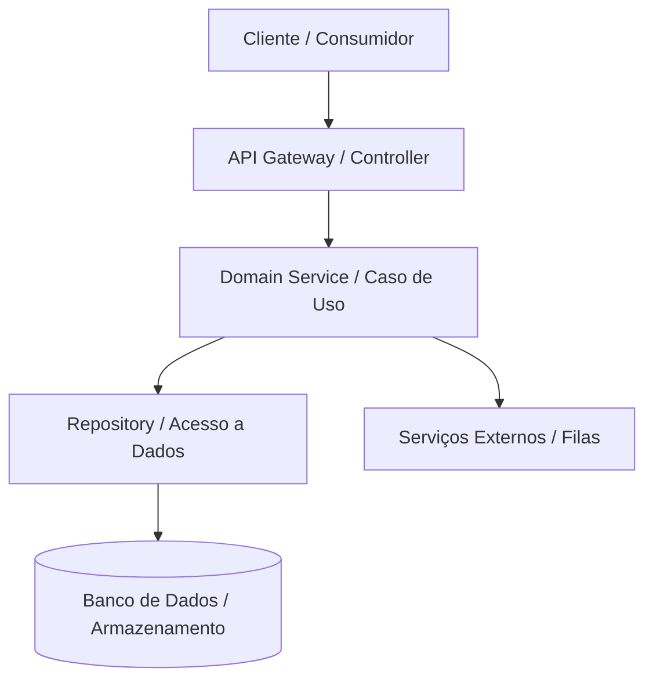

# Documento de Arquitetura: [PROJ-XXX] — [Título do Sistema / Módulo]

## 1. Metadados
- **Jira Issue:** [PROJ-XXX](https://seu-dominio.atlassian.net/browse/PROJ-XXX)
- **Status:** RASCUNHO | APROVADO | SUBSTITUÍDO
- **Versão:** 1.0.0
- **Responsável:** Arquiteto
- **Data:** AAAA-MM-DD

---

## 2. Visão Geral da Arquitetura
Descrição resumida da solução técnica, modelo estrutural adotado e limites do sistema (bounded context).

---

## 3. Diagrama Estrutural / Componentes

---

## 4. Módulos e Componentes Envolvidos
| Módulo / Camada | Responsabilidade | Tecnologias / Bibliotecas |
| :--- | :--- | :--- |
| `controllers/` ou `handlers/` | Recepção HTTP/RPC, validação de payload, formatação de saída | Framework web do perfil de linguagem |
| `services/` ou `usecases/` | Lógica de negócio pura, isolada de frameworks | Domínio da aplicação |
| `repositories/` | Abstração de persistência e persistência de dados | ORM ou driver nativo |
| `models/` ou `entities/` | Estruturas de dados tipadas e invariantes de domínio | Tipos nativos da linguagem |

---

## 5. Fluxos de Dados e Comunicação
1. **Entrada:** Origem dos eventos ou requisições.
2. **Processamento:** Como os dados são transformados e validados.
3. **Persistência / Saída:** Como o estado é salvo ou eventos são despachados.

---

## 6. Decisões Arquiteturais Relevantes (ADRs Relacionadas)
- [ADR-0001: Seleção de Estratégia de Persistência](../decisions/ADR-0001.md)
- [ADR-0002: Padrão de Comunicação Inter-serviços](../decisions/ADR-0002.md)

---

## 7. Requisitos Não Funcionais & Estratégia de Mitigação
- **Escalabilidade:** Como o componente escala horizontalmente.
- **Resiliência:** Timeouts, retries, circuit breakers, tratamento de falhas transientes.
- **Segurança:** Sanitização de entradas, isolamento de privilégios e criptografia em repouso/trânsito.
- **Observabilidade:** Logs estruturados em formato JSON, métricas (Prometheus/OpenTelemetry) e tracing distribuído.

---

## 8. Débito Técnico e Riscos Identificados
- Limitações da abordagem adotada.
- Mitigações planejadas para fases futuras.
