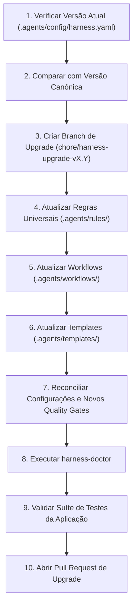

# Workflow de Atualização do Harness (Harness Upgrade)

## 1. Objetivo
Permitir que projetos existentes que já utilizam o Application Development Harness sejam atualizados para versões mais recentes do padrão Defendi de forma segura, determinística e sem perda de código de negócio ou configurações locais customizadas.

---

## 2. Princípios de Não-Regressão
- **Preservação de Código:** O código da aplicação sob `src/`, `cmd/`, `internal/`, etc., NUNCA deve ser modificado pelo processo de upgrade do harness.
- **Preservação de Configuração Local:** Arquivos como `.agents/config/harness.yaml` e `.agents/languages/` devem ter suas customizações mescladas (merge), nunca sobrescritas cegamente.
- **Preservação de Histórico:** Todos os documentos já existentes em `docs/` (`specs/`, `architecture/`, `decisions/`, `execution/`) devem ser integralmente preservados.

---

## 3. Passo a Passo do Upgrade



### Etapa 1: Diagnóstico de Versão
1. Ler o campo `harness.version` em `.agents/config/harness.yaml`.
2. Identificar quais releases intermediárias precisam ser aplicadas.

### Etapa 2: Isolamento em Branch
Criar um branch dedicado:
```bash
git checkout -b chore/harness-upgrade-v1.1.0
```

### Etapa 3: Sincronização de Componentes Globais
Copiar do repositório canônico `Harness Padrão`:
- `.agents/rules/` (novas diretrizes de segurança, Git e Jira)
- `.agents/workflows/` (novos fluxos operacionais)
- `.agents/templates/` (novos modelos de artefatos)
- `scripts/harness-doctor.py`

### Etapa 4: Reconciliação do `harness.yaml`
Adicionar novos campos ou novos gates sem remover configurações customizadas prévias do projeto:
```yaml
# Atualizar versão mantendo dados do projeto
harness:
  version: "1.1.0"
```

### Etapa 5: Validação Automatizada de Sanidade
Executar a ferramenta de auditoria:
```bash
python3 scripts/harness-doctor.py .
```
Garantir que a saída reporte `0 failures`.

### Etapa 6: Verificação de Build e Testes da Aplicação
Executar os testes da aplicação conforme o comando do language profile (ex.: `uv run pytest` ou `go test ./...`) para garantir que o projeto continua 100% íntegro e operacional.

### Etapa 7: Commit e PR
Realizar o commit atrelado a um card ou tarefa de manutenção:
```bash
git commit -m "chore(harness): [DEF-000] atualiza padrao de engenharia para v1.1.0"
```
Submeter PR para aprovação do Tech Lead.
